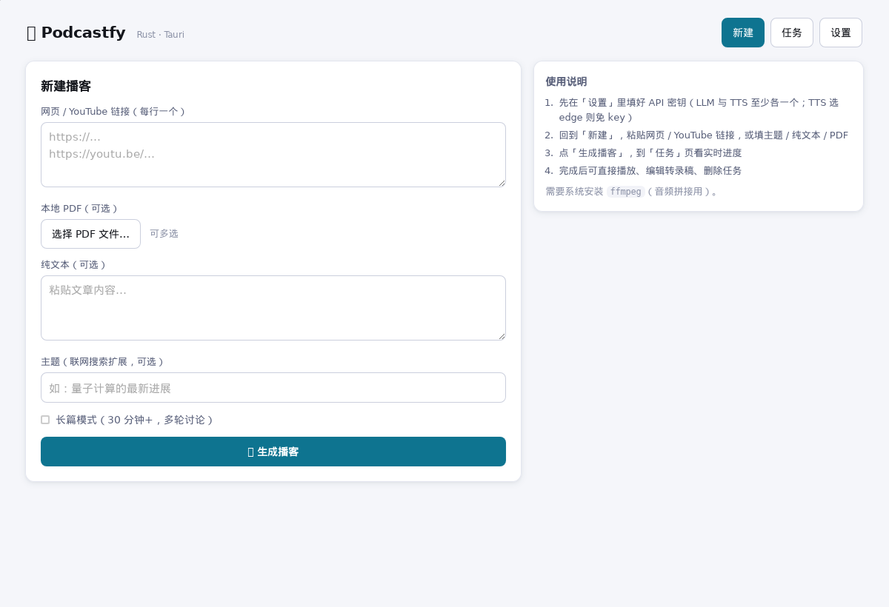
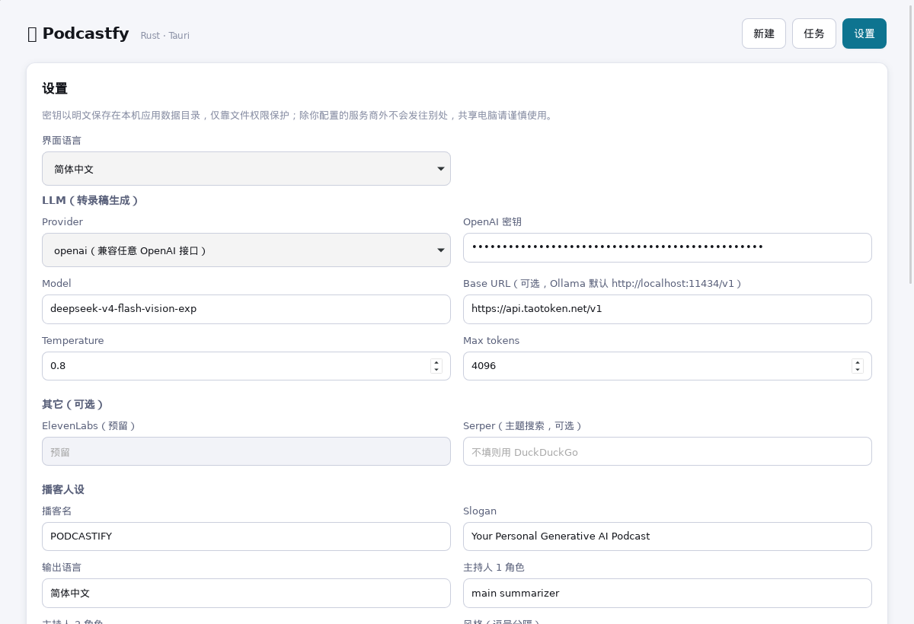
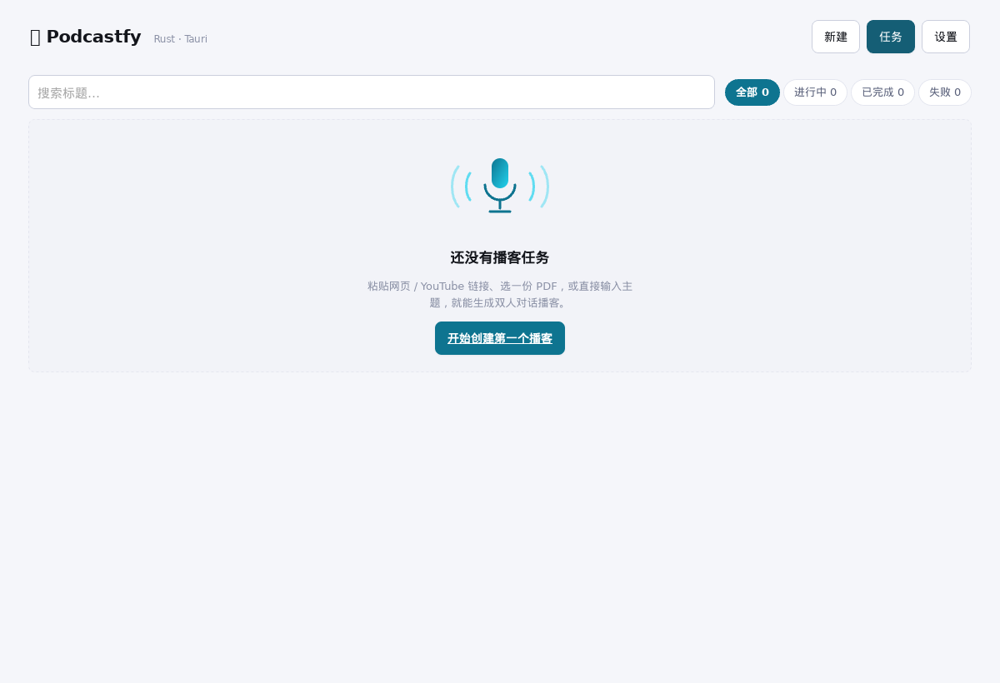

# PodcastfyUI

**用纯 Rust 重写 Podcastfy：把网页、PDF 和一段文字，变成一档双人对话播客。**

PodcastfyUI 是 [podcastfy](https://github.com/souzatharsis/podcastfy)（NotebookLM「生成播客」能力的开源复刻）的**桌面图形界面版**：核心引擎用**纯 Rust 重写**，不需要 Python 环境、不下载任何本地 AI 模型——本机只负责内容抽取、对话编排与音频拼接。输入也可以是**一个主题**（联网搜索扩展后再成稿）。

📖 **项目介绍博文**：[用纯 Rust 重写 Podcastfy：把网页、PDF 和一段文字，变成一档双人对话播客](https://blog.csdn.net/qq8864/article/details/165128044)



## ✨ 特色

| | 说明 |
|---|---|
| 🦀 **纯 Rust 引擎** | 无 Python、无 CUDA、无本地模型权重；一个可执行文件搞定编排，安装体积与启动速度都按桌面应用的标准来 |
| 🎙️ **真·双人对话** | 不是 TTS 朗读稿：由 LLM 生成主持人 1 / 主持人 2 的交替台词，逐行合成后拼接成一段完整播客 |
| 🔌 **多 LLM / 多 TTS** | LLM 支持 OpenAI 兼容（含各类中转网关）、Anthropic、Gemini、Ollama 本地；TTS 支持 OpenAI、Edge（免费免 key）、豆包（火山引擎） |
| 🈶 **中文优先** | 输出语言支持**简体中文 / 繁體中文 / English**；选中文时自动回退到中文音色与中文 YouTube 字幕轨道，不再读出「英文腔中文」 |
| ✂️ **转录稿可编辑** | 完成后可查看、修改、保存对话稿，并**只重新合成音频**（不重跑 LLM，省时省钱） |
| 📊 **四阶段流水线** | 抽取 → 生成对话稿 → 逐行 TTS → ffmpeg 拼接，每一步都有实时进度、可取消、可删除 |
| 🩺 **自检探针** | 设置页一键测试 LLM / TTS / ffmpeg 连通性，配置错了立刻知道错在哪一环 |
| 🌐 **中英双语界面** | 界面文案中英切换，中文为默认语言 |
| 🔒 **本地优先** | 密钥与配置都只存在本机应用数据目录，见 [PRIVACY.md](PRIVACY.md) |

## 🧭 能力边界（先说清楚）

- **不做本地推理**：所有生成都调用远端 LLM / TTS 服务，本机不跑模型。
- **ffmpeg 不自带**：启动时会自检系统 `ffmpeg`，缺失会明确提示而不是静默失败。
- **Edge TTS 是免费公共接口**：无需 key，但受微软服务波动影响，偶发返回 400 不可用（此时换豆包或 OpenAI TTS）。
- **OpenAI TTS 端点固定**、**API key 明文存储**：见「配置」小节与 [PRIVACY.md](PRIVACY.md)。
- **任务不跨重启持久化**：当前版本任务列表在内存中，重启应用后需重新发起（已在路线图中）。

> 定位一句话：**只做编排，不做推理。** 把「一堆素材」编排成「一段能听的播客」，这是它全部的工作。

## 🏗 流水线


四阶段各自独立：抽取失败不影响已生成的对话稿；转录稿改完可以只重跑 ③④，跳过费钱的 ②。技术细节见 [docs/architecture.md](docs/architecture.md) 与 [docs/modules.md](docs/modules.md)。

## 🚀 快速开始

前置：**Rust** 工具链、**Node 18+**、系统已安装 **ffmpeg**（音频拼接必需；应用启动会自检）。

```bash
# 从 GitCode 克隆（国内访问快）
git clone https://gitcode.com/qq8864/PodcastfyUI.git
#   或从 GitHub 克隆（两仓内容同步）
# git clone https://github.com/yangyongzhen/PodcastfyUI.git
cd PodcastfyUI

npm install          # 首次安装前端依赖

npm run tauri dev    # 开发模式（热重载）
npm run tauri build  # 生产构建，产物在 src-tauri/target/release/bundle/
```

首次启动后进入 **设置** 页完成三项配置（下方「配置」有逐项说明），点「测试连接」确认全绿即可开工。

## ⚙️ 配置

配置文件目录（Linux）：`~/.local/share/com.podcastfy.ui/`（其它平台见 Tauri `app_data_dir`）

| 文件 | 内容 |
|---|---|
| `api_keys.json` | 各服务 API key（**明文**，见 [PRIVACY.md](PRIVACY.md)） |
| `llm.json` | LLM 提供方、Base URL、模型名、采样参数 |
| `conversation.yaml` | 播客名、角色、音色、输出语言等会话配置 |



### LLM（设置 → 语言模型）

| Provider | 说明 |
|---|---|
| `openai`（兼容任意 OpenAI 接口） | 填 Base URL + 模型名即可接自有网关或第三方中转 |
| `anthropic` / `gemini` | 填对应 key 与模型名 |
| `ollama` | 本地模型，默认连 `http://localhost:11434/v1`，无需 key |

### 语音合成（设置 → 语音合成）

| TTS 模型 | 需要配置的参数 | 备注 |
|---|---|---|
| `edge` | 仅音色 | **免费免 key**，默认 `zh-CN-XiaoxiaoNeural`（人 1）/ `zh-CN-YunxiNeural`（人 2） |
| `openai` | API key + 音色（+ 模型，默认 `tts-1-hd`） | 端点固定为 `api.openai.com` |
| `doubao`（火山引擎） | **App ID + Access Token + 集群 cluster + 主持人 1/2 音色** | 参数最多，音质与稳定性好；音色需在火山控制台开通「大模型语音合成」 |

豆包示例：集群填 `volcano_tts`，两个音色分别填两位主持人的 `voice_type`——已验证可用的一对是 `zh_female_wanwanxiaohe_moon_bigtts`（人 1）+ `zh_male_wennuanahu_moon_bigtts`（人 2）。**两位主持人务必用不同音色**：填成同一个就变成「同一人自问自答」，实测已踩过这个坑。

### 输出语言

支持 `简体中文` / `繁體中文` / `English`（可手动输入自定义值）。选中文时：自动使用中文音色、中文 YouTube 字幕轨道优先。

## 🧑💻 使用步骤

1. **设置**：至少配一个 LLM key；TTS 选 `edge` 则完全不用 key；点「测试连接」自检 LLM / TTS / ffmpeg。
2. **新建**：粘贴链接（每行一个）、选择本地 PDF、直接贴文本，或只给一个主题（可联网搜索扩展）；长内容勾选长篇模式。
3. **任务**：看四阶段实时进度，可取消 / 删除；完成后直接播放或打开音频文件。
4. **转录稿**：查看、编辑、保存；改完用「仅重新合成音频」重生成音频，不必重跑 LLM。



## 📚 文档

- [docs/architecture.md](docs/architecture.md) — 架构设计与流水线
- [docs/modules.md](docs/modules.md) — 各模块职责
- [docs/api.md](docs/api.md) — Tauri 命令 / 事件 API
- [docs/devlog.md](docs/devlog.md) — 开发日志与踩坑记录
- [docs/release-readiness.md](docs/release-readiness.md) — 上架就绪度
- [docs/introducing-podcastfyui.md](docs/introducing-podcastfyui.md) — 项目介绍长文
- [docs/roadmap.md](docs/roadmap.md) — 后续优化路线：音频 → 视频（L1–L4 分档计划）

## 📖 延伸阅读

- [用纯 Rust 重写 Podcastfy：把网页、PDF 和一段文字，变成一档双人对话播客](https://blog.csdn.net/qq8864/article/details/165128044) — CSDN 博文：为什么放弃 Python 版、纯 Rust 引擎怎么落地、踩过哪些坑

## 📌 状态与路线

MVP 已完成（2026-09-12）：`cargo check` ✅ · `cargo test` ✅ · `svelte-check` 0 错 0 警 ✅ · `vite build` ✅

真实端到端已跑通（2026-09-12，真实三方服务、全程无 mock）：真实 LLM 生成 34 行对话稿 → 豆包 TTS **29/29 行**全部合成成功（人 1 女声 / 人 2 男声）→ ffmpeg 拼接出 **202.5 秒**双人对谈 mp3（24 kHz / 单声道）。

后续：任务持久化 · ElevenLabs / Gemini 多说话人 TTS · 拖拽文件输入 · 应用图标与各平台打包分发（deb / rpm / AppImage → Windows）· **音频 → 视频导出**（L1–L4 分档计划见 [docs/roadmap.md](docs/roadmap.md)）。

## License

Apache-2.0（与上游 podcastfy 一致）。
